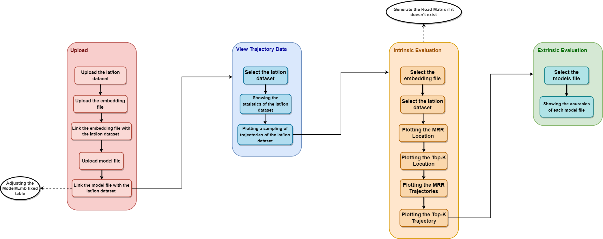
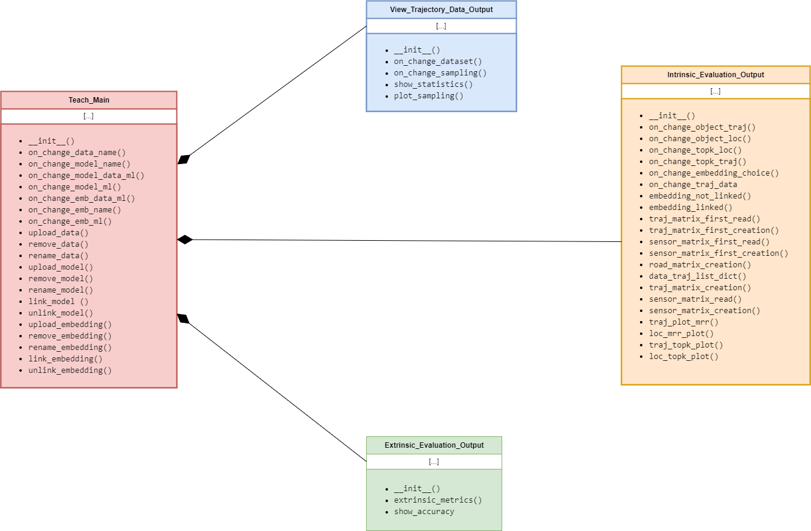

# TEACH - Trajectory Embedding Comparator Benchmark

The problem of selecting the most appropriate trajectory embedding is challenging since the quality of the trajectory representation significantly influences the global performance of the machine learning model.

Based on the comparative analysis, it may be helpful to offer comparative experimental results between different embedding models for researchers to determine the most appropriate embedding for their neural network. We take inspiration from the natural language processing (NLP) domain, which provides different comparisons between word embedding vectors to ensure the quality of word representation before using it in a machine learning task. The evaluation methods are classified into two main categories: intrinsic and extrinsic. Intrinsic evaluation is independent of a specific task and seeks similarity and relatedness between words. Unlike the extrinsic comparison, the assessment is integrated into an NLP task. 

TEACH (Trajectory Embedding compArator benCHmark) assesses trajectory embeddings qualitatively to help researchers select a proper trajectory embedding representation before passing through a coupled neural network. This work is based on the ideas presented in the following paper: [Modeling Trajectories Obtained from External Sensors for Location Prediction via NLP Approaches ](https://www.mdpi.com/1424-8220/22/19/7475)


## Activating the TEACH

At first, create an environment in anaconda named *teach_env*:

```
> conda create -n teach_env python=3.8.3 
```

Enter the environment using:

```
> conda activate teach_env
```

Execute the following commands:

```
> conda install -c conda-forge voila pymove nltk=3.7 ipython=8.8.0 
```
```
> conda install tensorflow=2.9.1 matplotlib=3.6.2
```
```
> conda install -c conda-forge osmnx=1.2.2 networkx=2.8.5 scikit-learn=1.0.2
```


Clone the repository:

```
> git clone https://github.com/InsightLab/teach.git
```


Enter in the *app* directory:

```
> cd app
```

Add to the *lat_lon_sensors* directory a *.csv* table containing the following attributes: *geos25*, *lat*, *lon*, *nodeId*, *nodeLat*, *nodeLon*, *token_id*. Finally, to use the tool just run the following command:

```
> voila teach.ipynb
```

## Using the TEACH

### Upload

With the tool is activated, when opening the tool, four tabs will be shown, the first tab is the *Data Upload*, *Embeddings Upload* and *Models Upload* tab, separated into three accordions

1. **Datasets Import**:In this sector it is possible to upload data in *lat/lon* format (*.csv*) considering them with a format containing at least three attributes: time, lat, lon and trajectory_id. In addition, it is possible, if necessary, to change the name of the imported data as well as to remove it with consequences for other accordions and other tabs.
2. **Embeddings Import**:This is the sector responsible for importing *embedding* files, which are *.csv* files containing a tokenization table and the embedding matrix associated with the tokens of that tokenization table. The name of this file can be changed, as well as this file can be removed if necessary, with consequences for other accordions and tabs. In the second tab of that same sector, we have a screen responsible for linking an embedding file to a data set imported in *Dataset Import*.
3. **Models Import**: Finally, we have the sector responsible for uploading models in *.h5* format, where it is possible to rename the uploaded file or remove this file, with consequences for accordions and other tabs. Furthermore, it is possible to make the link between these models and the data set imported in *Dataset Import*.

Both the imported embedding files and the imported models are saved in a *.csv* file with the names *Emb.csv* and *Model.csv* respectively, while the links of the embedding files are saved in the *Emb#Data.csv* file , as well as the link to the models saved in the *Model#Data.csv* file. The links between models and embeddings files are saved in *Model#Emb.csv* in a fixed way without having to interact with the user, the names are fixed, if you want to use a model with a specific embedding you need to rename the embedding to the name placed in this table.

### View Trajectory Data

The second tab is a dataset study tab. At first you choose the dataset you want to understand its data disposition, after that there are two functionalities:

1. **Show Statistics**: This functionality returns a dataframe containing the *number_of_trajectories*, the *maximum_length_of_trajectories*, the *minimum_length_of_trajectories* and the *average_length_of_trajectories* at least and even has the *number_of_distinct_locations* attribute if the dataset has the *location_label* attribute.
2. **Sampling**:This functionality is responsible for plotting a sample of trajectories from the selected dataset with *k* trajectories.

### Intrinsic Evaluation

This is the tab responsible for studying the ability of an embedding trained by an NLP model to represent trajectories. In this tab, an embedding file is chosen that was imported in the first tab and a dataset linked with it initially and from this link I can:

1. **Mean Reciprocal Rank (MRR) Location**: Plot the MRR comparing three distance matrices referring to the embedding vectors (Cosine Matrix, Euclidean Matrix, Road Matrix) associated with each location of the trajectories dataset.
2. **Similar Locations**: Choose a tokenizer location and plot the locations most similar to that location, taking into account the cosine distance matrix obtained through the embedding vector associated with that location, analyzing whether the proximity associated with this embedding resembles spatial proximity, studying how much this embedding is representative.
3. **Mean Reciprocal Rank (MRR) Trajectory**: Plot the MRR comparing three distance matrices referring to the embedding vectors (Cossine Matrix, DTW Matrix, Edit Distance Matrix) defined as the vector obtained from the average of the embedding vectors of each location of a specific trajectory.
4. **Similar Trajectories**: Choose a trajectory from the trajectory dataset and plot the trajectories most similar to this trajectory, taking into account the cosine distance matrix obtained through the embedding vector associated with that trajectory, analyzing whether the proximity associated with this embedding is similar to spatial proximity, studying the how representative this embedding is.

The matrices used in this study may or may not be present in the matrices folder, if they are not, they are created, as well as the dataset of sequence type trejectories (different from *lat/lon*), which is saved in the trejectories folder. The Road Matrix, if it is not in the matrices folder, is created as soon as the tool is started.

### Extrinsic Evaluation

In the last tab, a comparison is made between the models imported in the first tab, analyzing their ability of - such as NLP transformer models, have the ability to predict texts - predict locations of a trajectory. The models will only appear to be selected if they have been linked in the first tab with a dataset. To generate the comparative dataframe of accuracy, for each model, a dataset of trajectories of the sequence type is loaded based on the dataset of trajectories *lat/lon* linked to it in the first tab and in the embedding file associated with it in the fixed table. In the dataframe appears for each model selected 3 types of accuracy plus the F1-Score.

### Basic User Experience Flow


## TEACH Class Diagram


The Teach_Main class is imported into the Jupyter Notebook file. The View_Trajectory_Output, Intrinsic_Evaluation_Output and Extrinsic_Evaluation_Output classes make up this main class as attributes of the class since removing and renaming *lat/long* datasets, removing and renaming embedding files, and removing and renaming model files directly change the tabs associated with these classes.

#

